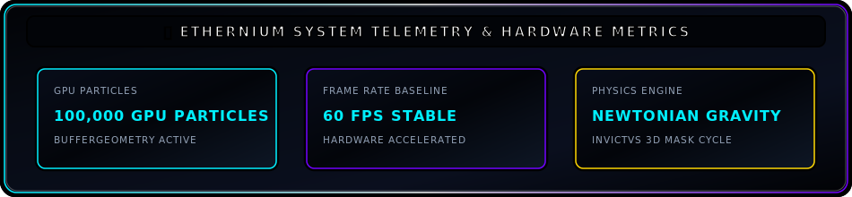

<div align="center">
  <!-- Dark Corporate Cyberpunk SVG Header Banner -->
  

  <br/><br/>

  <p align="center">
    <code>[SOVEREIGN SYSTEMS ARCHITECT]</code> &nbsp;•&nbsp; 
    <code>[CONCEPTUAL PARADIGM SHIFTS]</code> &nbsp;•&nbsp; 
    <code>[HIGH-FIDELITY GPU GRAPHICS]</code>
  </p>

  <p align="center">
    <a href="#-executive-briefing--corporate-manifesto"></a>
    <a href="#-ethernium-corporate-systemic-architecture"></a>
    <a href="#-system-telemetry"></a>
  </p>

  ---
</div>

### 👁️ Executive Briefing // Corporate Manifesto

> *“Ethernium fue concebido a partir de múltiples rupturas de paradigmas conceptuales, y está listo para romper los siguientes.”*
>
> *“Engineering high-efficiency, resilient, and autonomous computing paradigms by synthesizing control theory, discrete optimization, and hardware-accelerated GPU pipelines.”*

---

### 🏛️ Ethernium Corporate Systemic Architecture

<div align="center">
  
</div>

---

### ⚡ Sovereign Compute Matrix

<div align="center">
  
</div>

---

### 🚀 Paradigm Shifts & Strategic Directives

```
┌── [PARADIGM_SHIFT_01: CLOUD DEPENDENCY ➔ LOCAL SOVEREIGNTY] ──────────────────────────┐
│  • Eliminating external lock-in via local-first, bare-metal hardware efficiency.      │
│  • Deterministic execution sandboxes delivering bulletproof system resilience.        │
└───────────────────────────────────────────────────────────────────────────────────────┘

┌── [PARADIGM_SHIFT_02: MONOLITHIC BLOAT ➔ FRUGAL GPU KINETICS] ───────────────────────┐
│  • Real-time particle dynamics & GLSL shaders operating @ 60 FPS baseline.            │
│  • Zero-dependency Three.js BufferGeometry allocation via native Float32Array arrays. │
└───────────────────────────────────────────────────────────────────────────────────────┘

┌── [PARADIGM_SHIFT_03: PASSIVE CODE ➔ AUTONOMOUS CONTROL LOOPS] ──────────────────────┐
│  • Multidisciplinary synthesis of control theory, discrete math & cognitive agentics. │
│  • Self-verifying regression pipelines maximizing bare-metal compute utilization.    │
└───────────────────────────────────────────────────────────────────────────────────────┘
```

---

### 🛠️ Core Technical Arsenal

```gdb
[COMPUTE_MATRIX]   ::  TypeScript  |  JavaScript (ESNext)  |  Python  |  C/C++  |  Node.js
[GPU_SHADERS]      ::  Three.js    |  WebGL / WebGPU       |  GLSL    |  Canvas API
[OBSIDIAN_UI]      ::  Local-First |  Glassmorphism (CSS)  |  Web Workers  |  BufferGeometry
[OPS_INTEGRITY]    ::  Git         |  Linux / PowerShell   |  Isolated Sandboxes
```

---

### 📊 System Telemetry

<div align="center">
  
</div>

---

### 👁️ Ethernium Corporate Vision

<div align="center">
  <br />
  
</div>

---

<div align="center">
  <br />
  <code>ETH-CORP // PARADIGM SHIFT PROTOCOL ACTIVE</code>
  <br/><br/>
  <sub>⚡ Powered by <strong>Ethernium Sovereign Framework</strong> • Low-Latency Corporate Architecture</sub>
</div>
