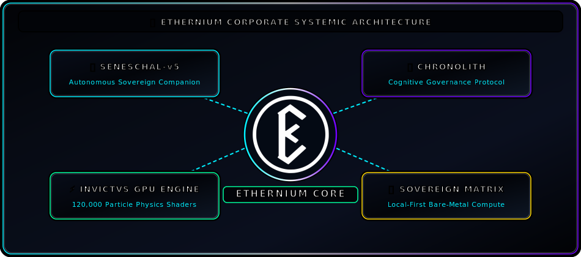
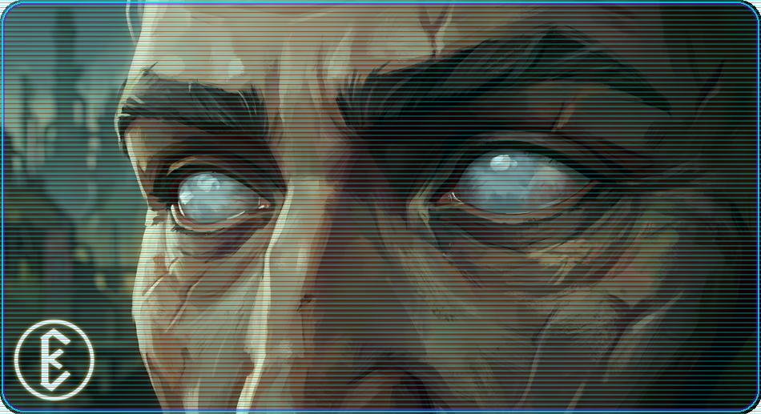

<div align="center">
  <!-- AAA Obsidian Glass Header Banner -->
  

  <br/><br/>

  <p align="center">
    <code>[SENESCHAL CHRONOLITH ARCHITECT]</code> &nbsp;•&nbsp; 
    <code>[SYNERGISTIC ARCHETYPAL MINDS]</code> &nbsp;•&nbsp; 
    <code>[HIGH-FIDELITY GPU SHADERS]</code>
  </p>

  <p align="center">
    <a href="#-seneschal-chronolith--synergistic-archetypal-matrix"></a>
    <a href="#-ethernium-sovereign-matrix"></a>
    <a href="#-system-telemetry--dark-ops-analytics"></a>
  </p>

  ---
</div>

### 👁️ Executive Briefing // Dark Ops Monolith Architecture

> *“Monolithic precision. Zero-trust compute. Synthesizing systems engineering, control theory, and GPU shader kinetics into sovereign, low-latency architectures.”*

---

### 🏛️ Seneschal Chronolith // Synergistic Archetypal Matrix

<div align="center">
  
</div>

---

### ⚡ Ethernium Sovereign Matrix // Obsidian Compute Panels

<div align="center">
  
</div>

---

### 🚀 Core Strategic Directives

```
┌── [DIRECTIVE_01: ETHERNIUM SIMULATION ENGINE] ────────────────────────────────────────┐
│  • Hardware-accelerated particle dynamics & shockwaves in custom GLSL vertex shaders. │
│  • Zero-dependency Three.js BufferGeometry allocation with Float32Array arrays.        │
│  • Obsidian glassmorphic telemetry HUDs operating @ 60 FPS baseline.                  │
└───────────────────────────────────────────────────────────────────────────────────────┘

┌── [DIRECTIVE_02: AUTONOMOUS SOVEREIGN AGENTS] ───────────────────────────────────────┐
│  • Multidisciplinary control loops leveraging cognitive & system engineering.           │
│  • Pre-tested isolated scratch sandboxes ensuring zero-regression deployment.           │
│  • Local-first deterministic workflows built for maximum machine hardware efficiency.   │
└───────────────────────────────────────────────────────────────────────────────────────┘
```

---

### 🛠️ Sovereign Arsenal // Tech Stack Matrix

```gdb
[COMPUTE_MATRIX]   ::  TypeScript  |  JavaScript (ESNext)  |  Python  |  C/C++  |  Node.js
[GPU_SHADERS]      ::  Three.js    |  WebGL / WebGPU       |  GLSL    |  Canvas API
[OBSIDIAN_UI]      ::  Local-First |  Glassmorphism (CSS)  |  Web Workers  |  BufferGeometry
[OPS_INTEGRITY]    ::  Git         |  Linux / PowerShell   |  Isolated Sandboxes
```

---

### 📊 System Telemetry // Full Spectrum Dark Ops Analytics

<div align="center">
  <br />
  
  
</div>

---

### 👁️ Ethernium Sovereign Vision // Archetypal Presence

<div align="center">
  <br />
  
</div>

---

<div align="center">
  <br />
  <code>ETH-SENESCHAL-CORE v5.1.0 // HOLOGRAM OPTICS ENGAGED</code>
  <br/><br/>
  <sub>⚡ Powered by <strong>Ethernium Sovereign Framework</strong> • Synergistic Archetypal Matrix</sub>
</div>
