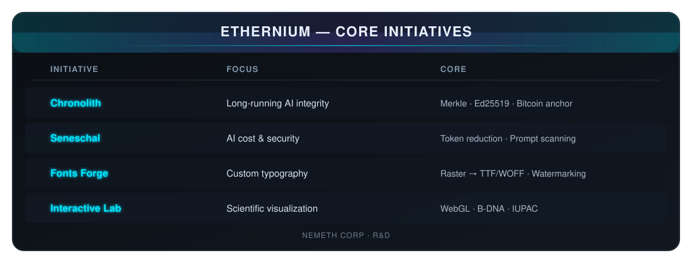
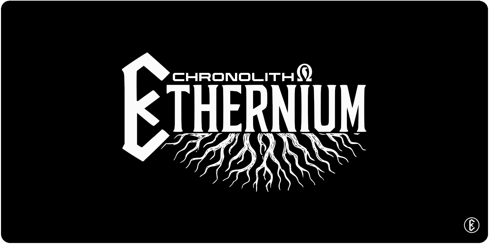
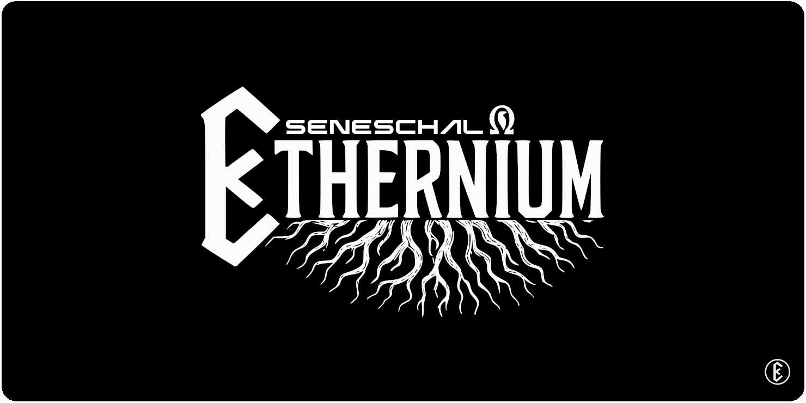
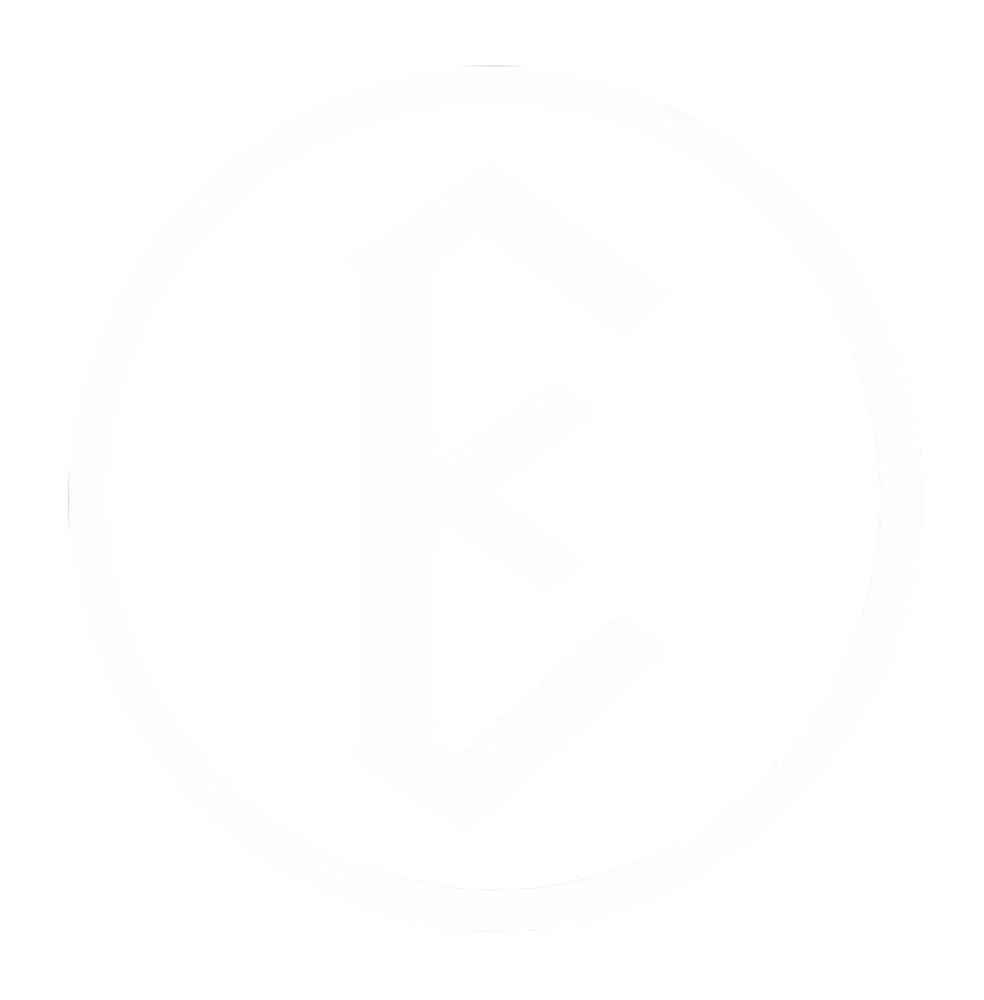

<!-- ETHERNIUM PROFILE README -->

  
    
  

  <code>[ECOSYSTEM]</code> &nbsp;  &nbsp;
  

  

    <code>[AI TOOLS]</code> &nbsp;•&nbsp;
    <code>[LOCAL-FIRST]</code> &nbsp;•&nbsp;
    <code>[OPEN SOURCE]</code>
  

  <!-- AAA HERO BADGE -->
  
    

  <!-- AAA SECTION BADGES -->
  

    
    
    
  

  <!-- AAA TECH BADGES -->
  

    
    
    
    
  

---

### Ethernium

**Ethernium** builds practical AI tools for people who work heavily with language models.

Focus:
- reduce cost
- keep control of long-running projects
- stay **local-first**

R&D by **Nulla-Labs// Nemeth Corp.**.

---

### Public Portfolio

  
  

    <i>Portfolio dashboard featuring Fonts Forge, Seneschal, and Chronolith — Click to launch the interactive 3D engine</i>
  

---

### Core Initiatives

  

---

### ***Main Projects***

#### Kaptura Ω

<table>
<tr>
<td width="58%" valign="middle">

**Sovereign Motion Capture & 120 FPS Vectorial Presentation Engine**

High-frequency telemetry recording, WebGL GPU rendering, and zero-loss vector export.

- **Tool 2: 60 FPS HD Cinematic Loop Banner** (`kaptura-cinema-loop.gif`)  
- **Tool 3: 120 FPS Native SVG Vectorial HUD** (`kaptura-video-hud.svg`)  
- **Editions: Core · Pro · Sovereign (Ω)**  

[Repo](https://github.com/SteveBlackbeard/KAPTURA-by-Ethernium)

</td>
<td width="42%" valign="middle">
  
</td>
</tr>
</table>

   
  
  

    <i>Kaptura Tool 2 — Live 60 FPS HD Cinematic Banner playing continuously in native loop</i>
  

---

#### Chronolith

<table>
<tr>
<td width="58%" valign="middle">

**Cryptographic integrity for long-running AI projects**

Merkle Trees + Ed25519 + Bitcoin anchoring (OpenTimestamps).  
Detects semantic drift and provides verifiable evidence of project state over time.

- Verifiable project baselines  
- Continuity across human–AI sessions  
- Editions: Lite · Pro · Omega  

[Repo](https://github.com/SteveBlackbeard/CHRONOLITH-by-Ethernium)

</td>
<td width="42%" valign="middle">
  
</td>
</tr>
</table>

---

#### Conekta Ω

<table>
<tr>
<td width="42%" valign="middle">
  
</td>
<td width="58%" valign="middle">

**Payment and Transaction Protocol Layer for AI & Autonomous Workflows**

High-throughput, cryptographically verified payment rail integrating fiat & decentralized networks.

- Automated settlement & transaction verification  
- Signed payment grants & autonomous execution  
- Editions: Core · Pro · Omega (Ω)  

[Repo](https://github.com/SteveBlackbeard/CONEKTA-by-Ethernium)

</td>
</tr>
</table>

---

#### Seneschal

<table>
<tr>
<td width="58%" valign="middle">

**Efficiency and security layer for AI workflows**

Local-first context selection, token reduction, and prompt/secret scanning.

- **88–92% token reduction observed in internal repository tests** (public benchmark methodology pending)
- Security scanning + intelligent model routing  
- Signed capability grants  

[Repo](https://github.com/SteveBlackbeard/SENESCHAL-by-Ethernium)

</td>
<td width="42%" valign="middle">
  
</td>
</tr>
</table>

---

#### Fonts Forge

<table>
<tr>
<td width="42%" valign="middle">
  
</td>
<td width="58%" valign="middle">

**Premium toolkit for designing and generating vector fonts**

Converts raster specimens into TTF / WOFF / WOFF2 with Bézier curve fitting, symmetry engine, and forensic watermarking.

- Complete raster → vector pipeline  
- Focused on branding and custom typography  

[Repo](https://github.com/SteveBlackbeard/FONTS-FORGE-by-Ethernium)

</td>
</tr>
</table>

---

### Interactive Lab

Visual engines and experimental interfaces:

  
  

    <i>Educational B-DNA visualization with a repeating base-pair motif; not a genomic or TP53 sequence — Click to launch the interactive 3D engine</i>
  

 

  
  

    <i>Complete 118-element IUPAC periodic table with Gold (Au) electron shell orbital view — Click to explore</i>
  

---

### Autonomous Terminal

  

---

### Nulla-Labs — R&D

**Nulla-Labs** is the R&D brand behind Ethernium, within Nemeth Corp.
It develops the software architectures, GPU rendering engines, autonomous systems, and AI pipelines that power the ecosystem.

  

---

### Technical Stack

  <!-- Languages & Compute -->
  
  
  
  
  
  
  
  

    

  <!-- Hardware & Embedded -->
  
  
  
  
  

    

  <!-- Git & Ops -->
  
  
  
  

    

  <!-- Tools & IDEs -->
  
  
  
  
  
  

    

  <!-- OS & Platforms -->
  
  
  
  
  

---

### Vision

Build practical, local-first systems whose claims can be inspected, reproduced, and improved over time.

  

---

  
    <strong>Ethernium Ecosystem</strong> — Practical AI tools with a local-first approach
     
    <strong>Nemeth Corp.</strong>
  
    
  

